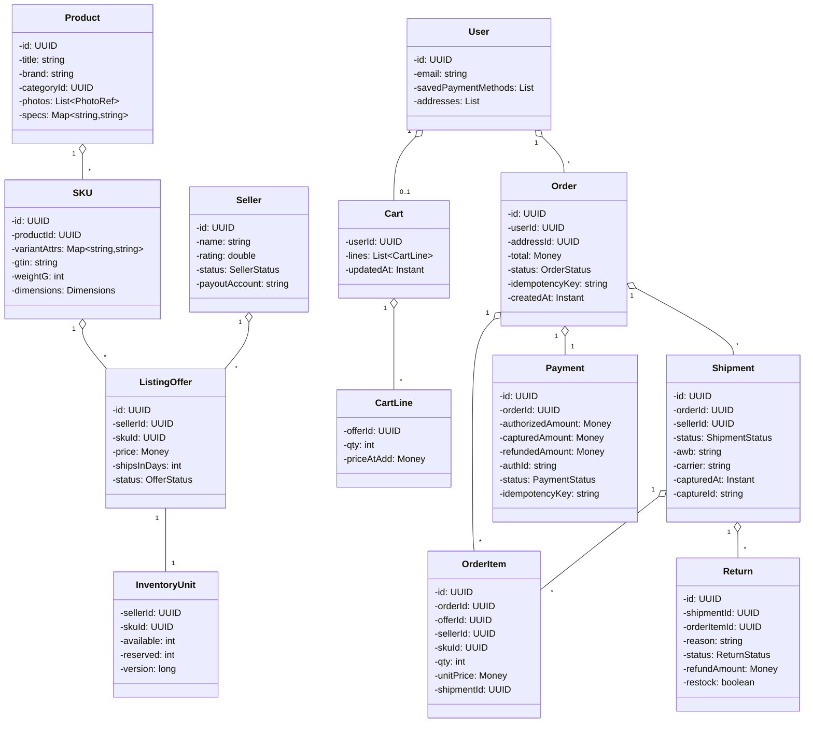

# 04 · E-Commerce — Domain Model

## Core entities



---

## Aggregates

| Aggregate root | Owns | Why root |
| --- | --- | --- |
| **Product** | SKUs, photos, specs | Catalog source-of-truth |
| **ListingOffer** | InventoryUnit, price, status | Atomic boundary — inventory is part of the offer |
| **Cart** | CartLines | Per-user, transient |
| **Order** | OrderItems, Shipments, Payment | The money-bearing root; one consistency boundary |
| **Shipment** | (within Order) item subset, capture, status | Independent fulfilment unit |
| **Return** | refund details, restock decision | Post-delivery aggregate |
| **Seller** | listing offers, payout account | Cross-cutting |

> **Key invariant**: An Order is **immutable in its line composition** once CONFIRMED. Status advances; line totals don't change. Edits = cancel + reorder. Shipments split lines but never duplicate them.

---

## Value objects

| Type | Notes |
| --- | --- |
| `Money` | `(amountMinor: long, currency: string)`. Integer minor units. |
| `Address` | Validated, geocoded; immutable per snapshot stored on the Order |
| `PhotoRef` | S3 URL + checksum |
| `Dimensions` | `(lengthCm, widthCm, heightCm)` — used for shipping rate calc |
| `Idempotency-Key` | UUID; UNIQUE per `(user_id, endpoint)` |
| `OfferScore` | `(price, sla, rating, prime) → numeric` for buybox |

---

## Key concepts

### The three-layer catalog

The single most important modelling decision in this system.

```
Product (logical)
   ├─ "Apple iPhone 15"  ← title, photos, reviews
   │    SKU (variant)
   │     ├─ "iPhone 15 / 128 GB / Black"  ← gtin, weight
   │     │    ListingOffer (per-seller)
   │     │     ├─ Acme Mobiles · ₹79,900 · 5 in stock
   │     │     ├─ PhoneBazaar · ₹74,999 · 1 in stock
   │     │     └─ QuickCells · ₹78,000 · 2 in stock
   │     └─ "iPhone 15 / 256 GB / Black"
```

**Why three layers and not two?**
- Combining Product + SKU loses variant search ("show me 256GB only").
- Combining SKU + Offer loses the buybox / multi-seller view.
- Each layer answers a distinct question: search (Product), variant pick (SKU), buybox (Offer).

This is identical in shape to Library's `Book → Copy` or Car Rental's `VehicleModel → Vehicle`, but with one extra layer because of the marketplace dimension.

### Inventory lives on the Offer

Inventory is **not** on Product or SKU — it's per-seller. `inventory_units(seller_id, sku_id)` is the row that decrements.

### BuyBox

For each `(sku_id)`, a *single* offer is the default. Algorithm:
```
score(offer) = w1 * inverse(price)
             + w2 * fulfilmentScore(shipsInDays)
             + w3 * sellerRating
             + w4 * (prime ? 1 : 0)
             + w5 * (inStock ? 1 : 0.5)
```
The strategy is pluggable: price-only buybox for promotion campaigns, prime-first for prime users, etc.

Buybox is **not stored on the offer** — it's a derived view, cached in Redis keyed by `sku_id`. Recomputes on event:
- Offer price/stock change.
- Seller rating change.
- Seller status change.

### Order vs Shipment

| Aspect | Order | Shipment |
| --- | --- | --- |
| Created when | User clicks Place Order | Implicit at Order, one per seller |
| Changes after creation | Status only (CONFIRMED → COMPLETED) | Status + AWB + capturedAt |
| Money meaning | Authorized total | Captured portion |
| Cancel scope | Full or partial | Independent |

An Order's "shipped" / "delivered" status is **derived** from its shipments, not stored independently. This avoids dual sources of truth.

### Two-phase payment

- **Authorize** at place-order: `Payment.authorizedAmount = order.total`. No money moves.
- **Capture** per shipment dispatch: `Payment.capturedAmount += shipment.amount`. Money moves now.
- **Refund** on cancel/return: `Payment.refundedAmount += amount`. Money moves back.

Invariant: `capturedAmount ≤ authorizedAmount`, `refundedAmount ≤ capturedAmount` (refund of an uncaptured amount is just a void).

### Idempotency

| Operation | Key | Constraint |
| --- | --- | --- |
| Place order | client UUID | `UNIQUE(user_id, idempotency_key)` on orders |
| Authorize | order_id | gateway dedupes |
| Capture | shipment_id | gateway dedupes |
| Refund | return_id or cancel_id | gateway dedupes |
| MIT for delayed capture | shipment_id + retry_counter | gateway dedupes |
| Webhook | gateway eventId | UNIQUE on processed_events |

### Cancellation policy

```java
interface CancellationPolicy {
  CancelOutcome decide(Shipment s, Instant now);
}

class StandardCancellationPolicy:
  if status in (CREATED, PACKED) → ALLOW, full refund
  if status == DISPATCHED        → ALLOW with caveat, full refund
  if status == OUT_FOR_DELIVERY  → DENY, must use returns flow
  if status == DELIVERED         → DENY, returns flow
```

Different policies per category (e.g., perishables disallow return).

### Return policy

```java
interface ReturnPolicy {
  boolean isEligible(Shipment s, Instant now);
  boolean isRestockable(Return r);
}
```

Eligibility windows differ per category; `isRestockable` decides whether inventory is incremented after inspection.

---

## Domain events

| Event | When |
| --- | --- |
| `OrderPlaced` | place-order saga succeeded |
| `OrderCancelled` | full or partial cancellation |
| `ShipmentPacked` | seller marked PACKED |
| `ShipmentDispatched` | capture occurred |
| `ShipmentDelivered` | carrier callback or buyer confirm |
| `PaymentCaptured` | gateway capture ok |
| `PaymentRefunded` | refund ok |
| `ReturnRequested` | buyer initiated |
| `ReturnApproved` | ops/seller approved |
| `ReturnInspected` | warehouse inspection complete |
| `BuyBoxChanged` | new winning offer per SKU |
| `OfferUpdated` | price/stock change |
| `SellerSuspended` | ops action |

---

## Output

```
Catalog:    Product → SKU → ListingOffer (3 layers)
Inventory:  inventory_units (seller_id, sku_id) — atomic CAS
Cart:       transient lines, no reservations
Order:      aggregate root with embedded Payment + Shipments; immutable lines post-CONFIRMED
Shipment:   aggregate sub-unit, owns capture, can cancel/refund partial
Payment:    AUTH → CAPTURE → REFUND with running totals
Returns:    async post-delivery aggregate; refund + optional restock
BuyBox:     derived, cached, strategy-driven view per SKU
```
