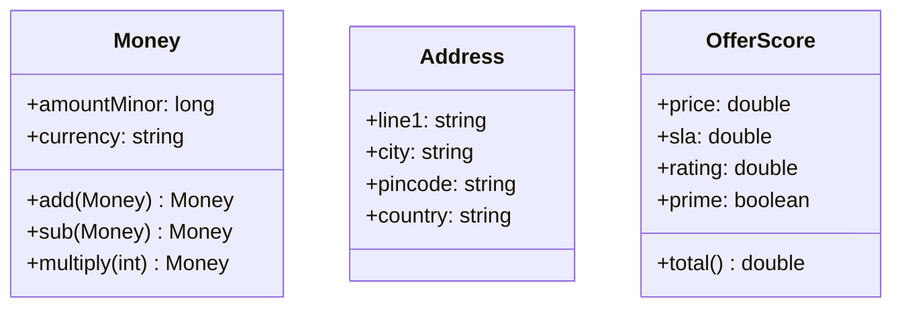
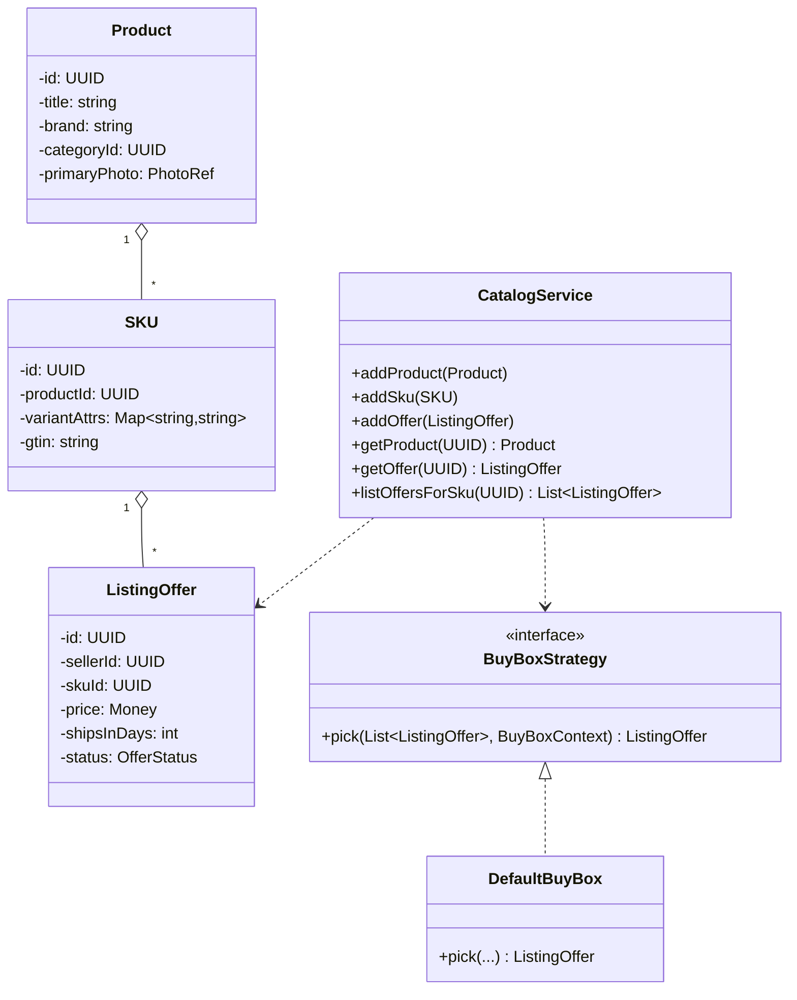
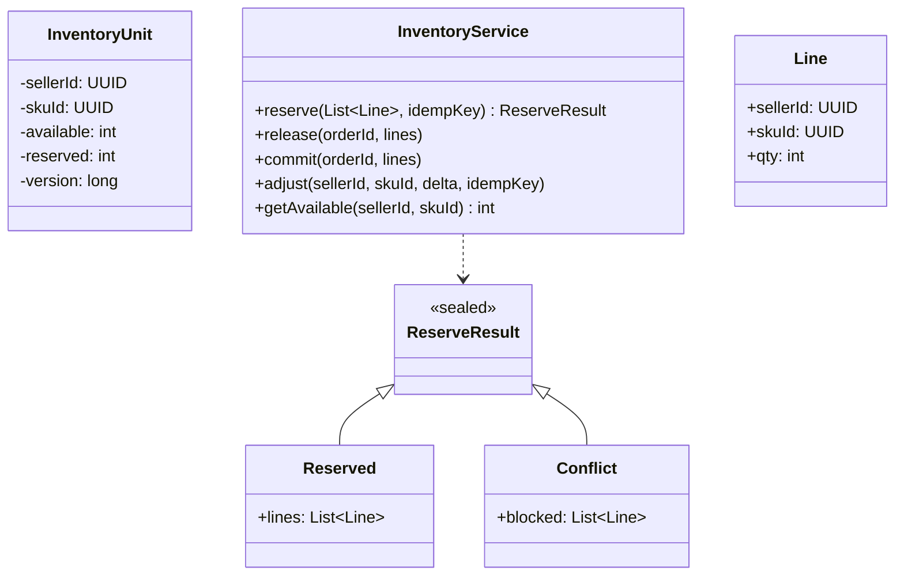
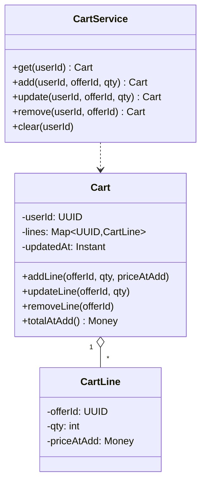
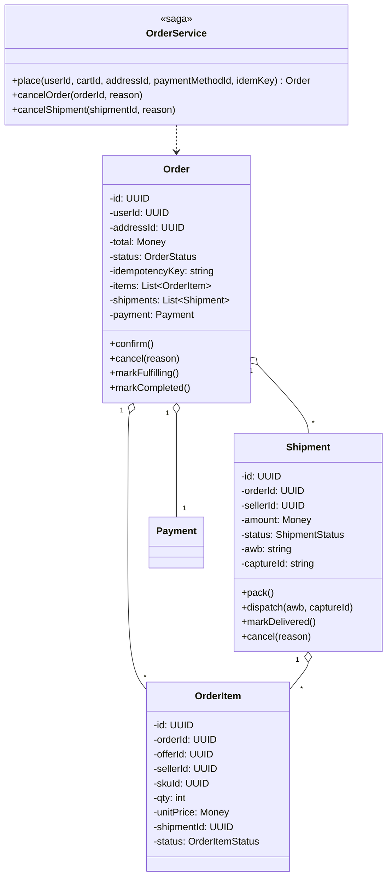
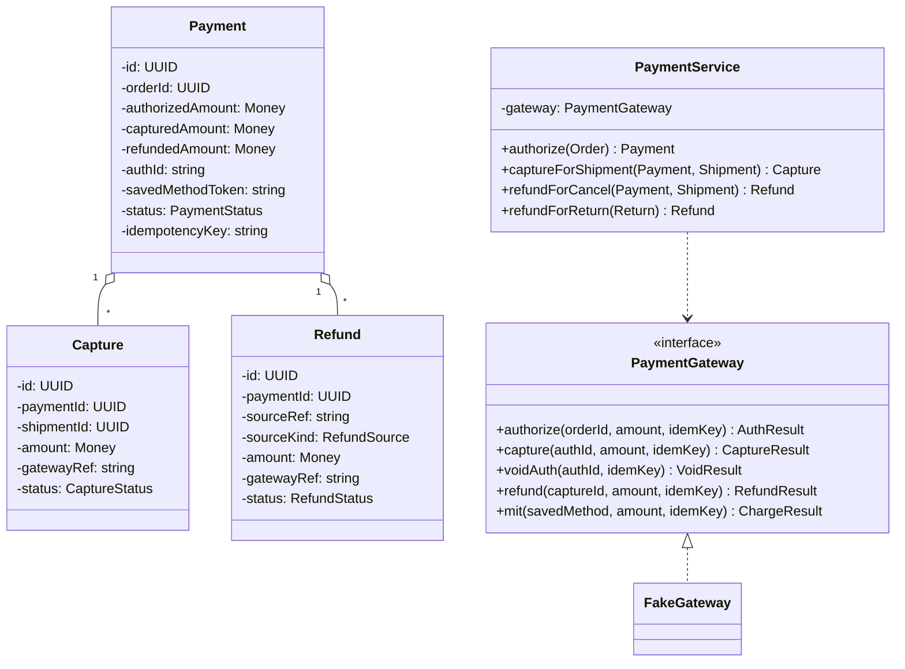
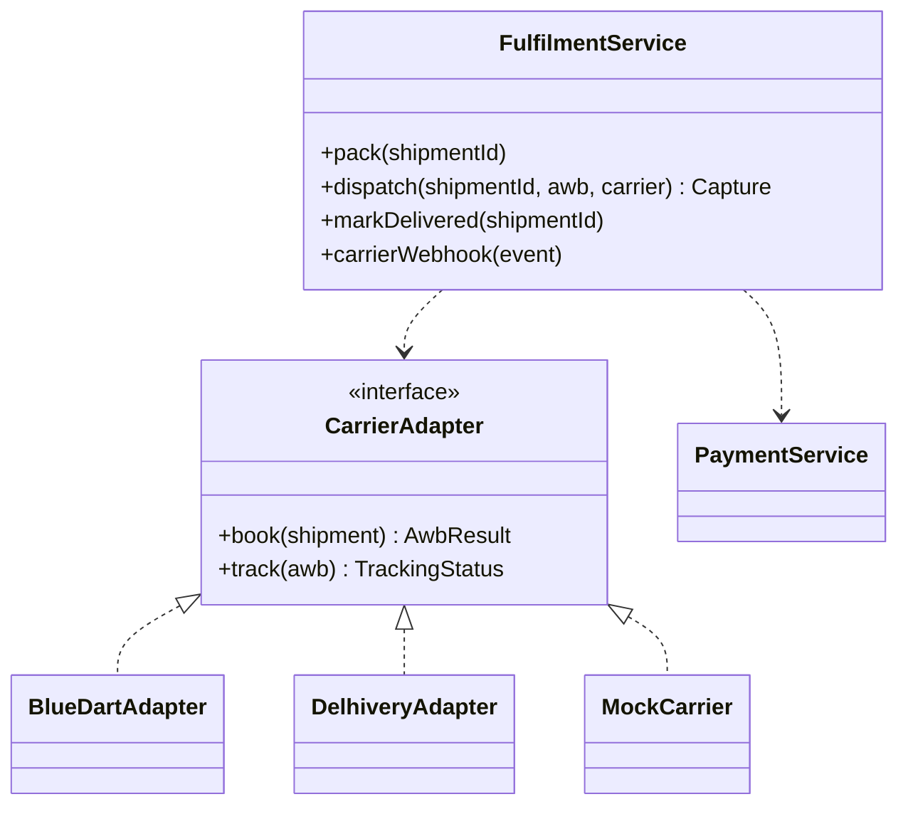
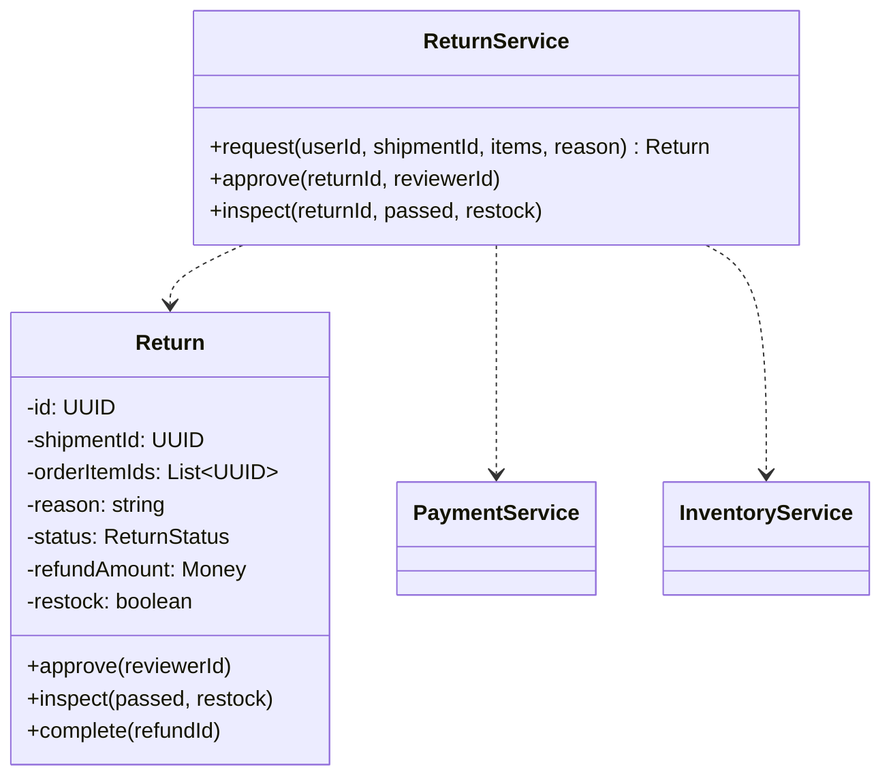

# 07 · E-Commerce — Class Diagrams

## Package layout

```
com.ecommerce
 ├── domain/        Money, Address, ids, enums, value objects
 ├── catalog/       Product, SKU, ListingOffer, CatalogService, BuyBoxStrategy
 ├── inventory/     InventoryUnit, InventoryService (atomic CAS)
 ├── cart/          Cart, CartLine, CartService
 ├── order/         Order, OrderItem, Shipment, OrderService (the saga)
 ├── payment/       Payment, Capture, Refund, PaymentGateway, PaymentService
 ├── fulfillment/   Shipment lifecycle ops, FulfilmentService
 ├── api/           DTOs, controller bindings (omitted in skeleton)
 └── store/         in-memory repositories
```

---

## Domain & value objects



---

## Catalog



`DefaultBuyBox` scores each candidate offer against `(price, shipsInDays, sellerRating, prime)` and returns the highest-scoring active, in-stock offer.

---

## Inventory (the heart of the buy plane)



`InventoryService.reserve(...)` does the CAS per line in one TXN:
- For each line: `UPDATE inventory_units SET available = available - qty WHERE … AND available >= qty`.
- If any UPDATE returned 0 rows, mark conflict and *re-increment* the lines that did decrement (compensate within the same TXN).
- Return `Reserved(lines)` or `Conflict(blocked)`.

The sealed `ReserveResult` keeps the success / conflict paths exception-free in the hot path.

---

## Cart



CartService writes both Redis (hot) and Postgres (durable). Reads come from Redis; on miss, fall back to Postgres and warm.

---

## Order (the saga)



`OrderService.place(...)` orchestrates:
1. Idempotency lookup (return cached on duplicate).
2. Hydrate cart + recompute prices.
3. Group cart lines by `seller_id` → one shipment per seller.
4. `InventoryService.reserve(...)` — atomic CAS across all lines.
5. `PaymentService.authorize(...)` — gateway hold.
6. Persist Order + OrderItems + Shipments + Payment + outbox in one TXN.
7. Return.

Each failure compensates priors (release inventory, void auth).

---

## Payment



The gateway abstraction has five operations; the service composes them based on context. Refund routing logic:
- If shipment cancelled before capture → `voidAuth(authId, partialAmount)`.
- If shipment cancelled after capture → `refund(captureId, amount)`.
- If return refund → `refund(captureId, amount)` (always against captured charge).

---

## Fulfilment



Dispatch triggers capture: a single `dispatch(shipmentId, …)` call performs (a) status transition PACKED→DISPATCHED, (b) capture on the gateway, (c) outbox event, all in one TXN.

---

## Returns



`inspect(passed=true)` triggers `PaymentService.refundForReturn(...)` and (if restockable) `InventoryService.adjust(...)` to put the unit back.

---

## Why these abstractions

| Abstraction | Why |
| --- | --- |
| `InventoryService` returning sealed `ReserveResult` | Two paths (Reserved / Conflict) without exceptions on the hot place-order path |
| `BuyBoxStrategy` interface | A/B test scoring algorithms; per-category overrides |
| `PaymentGateway` interface with `mit` separate | Delayed capture / refund needs MIT; modeling as a separate op makes intent explicit |
| `Order` immutable lines post-CONFIRMED | Edits would corrupt inventory accounting; force cancel + reorder |
| `Shipment` as own aggregate sub-unit | Per-shipment capture, status, cancel — independent lifecycle |
| `CarrierAdapter` interface | Adding a new courier is a new class, no edits to FulfilmentService |
| `Capture` / `Refund` as first-class entities (not just status flags on Payment) | Clean ledger; multi-shipment / partial refund tracking |

---

## Output

```
Catalog:    Product → SKU → ListingOffer + BuyBoxStrategy
Inventory:  InventoryUnit + InventoryService(reserve, release, commit, adjust)
Cart:       Cart, CartLine + CartService(add, update, remove)
Order:      aggregate + OrderService(saga: place, cancel)
Shipment:   sub-aggregate; pack → dispatch → delivered
Payment:    PaymentGateway interface + PaymentService(auth, capture, void, refund, mit)
Fulfilment: per-carrier adapter pattern
Returns:    ReturnService(request, approve, inspect → refund + optional restock)
```
