# 08 · E-Commerce — Sequence Diagrams

## 1. Search → product detail

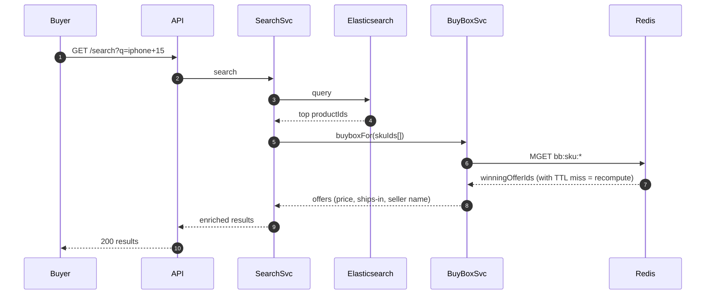

The ES index is refreshed via CDC from `listing_offers` and `inventory_units` every ~30 s. Search is intentionally eventually consistent — place-order is the consistency oracle.

---

## 2. Add to cart

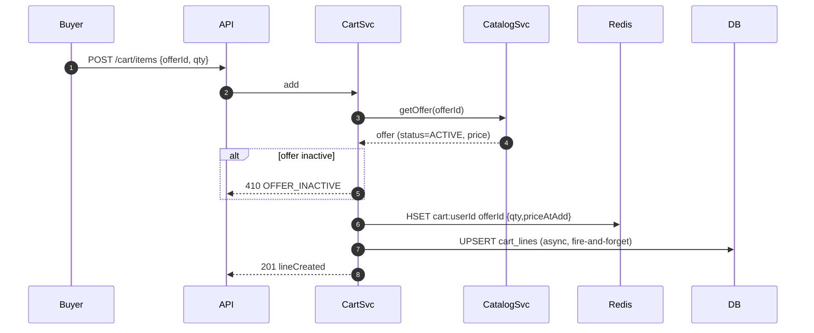

Cart never touches inventory — that's at place-order.

---

## 3. Place order — happy path

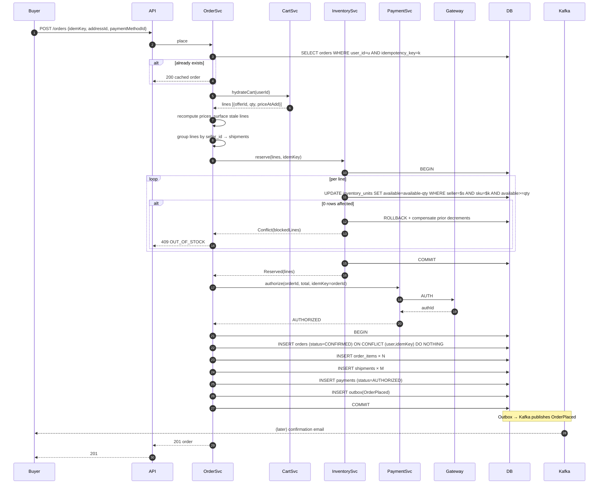

---

## 4. Place order — inventory conflict (rollback)

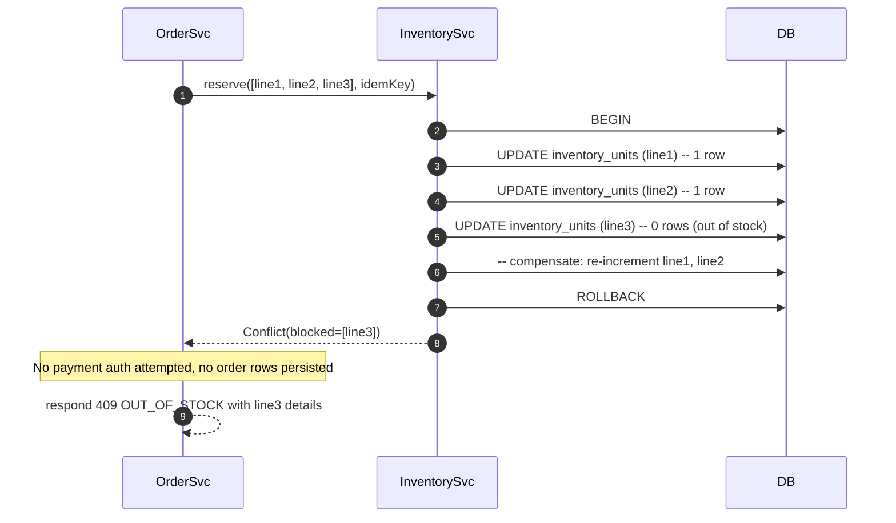

We use ROLLBACK for the entire savepoint (cleaner than manual compensation) — the BEGIN/ROLLBACK around all UPDATEs ensures atomicity in Postgres.

---

## 5. Place order — payment declined

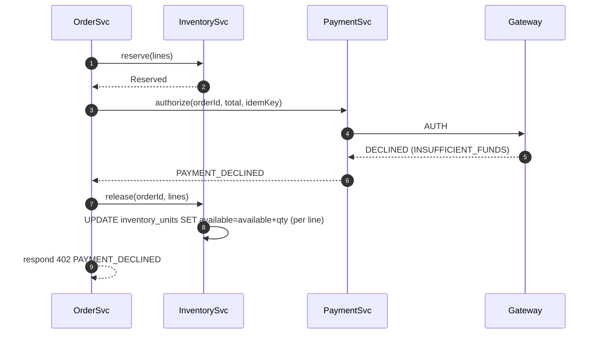

The compensation here is a *separate* TXN (the reserve TXN already committed). The compensating UPDATE is itself idempotent because we key it by `orderId` in a held-lines table or via the outbox.

---

## 6. Shipment dispatch (capture)

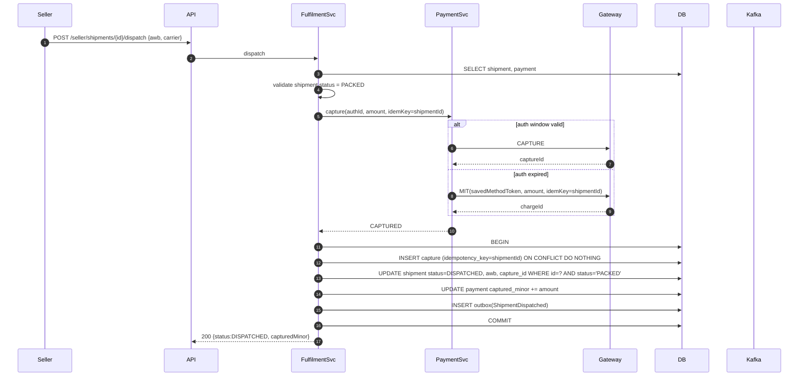

---

## 7. Cancel shipment (auth still open)

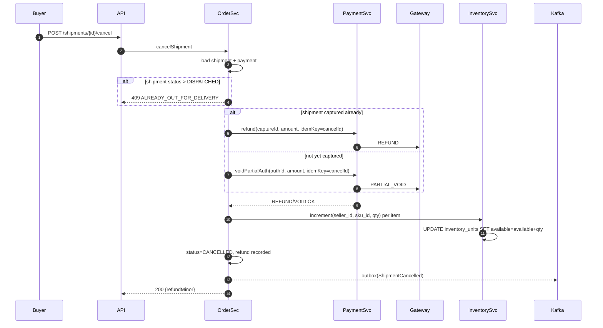

Cancellation routes the refund based on whether the shipment was already captured or still in AUTH state. Inventory is restored regardless.

---

## 8. Return → refund

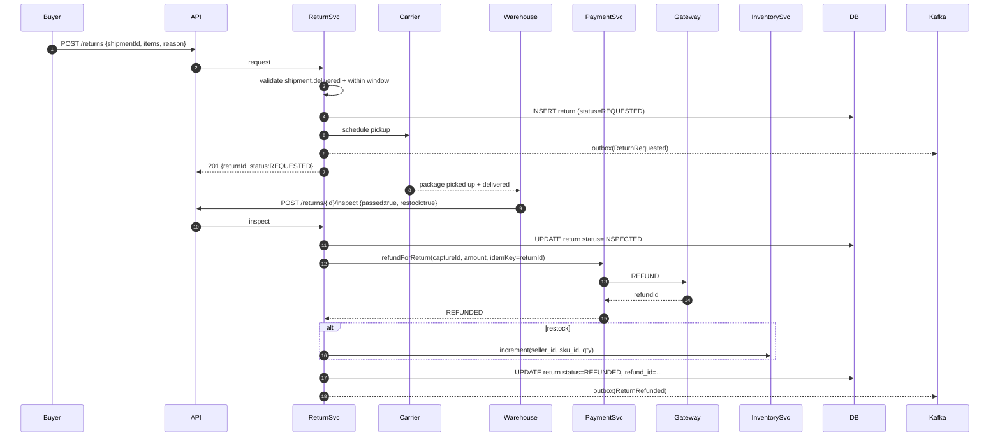

---

## 9. Webhook — payment captured

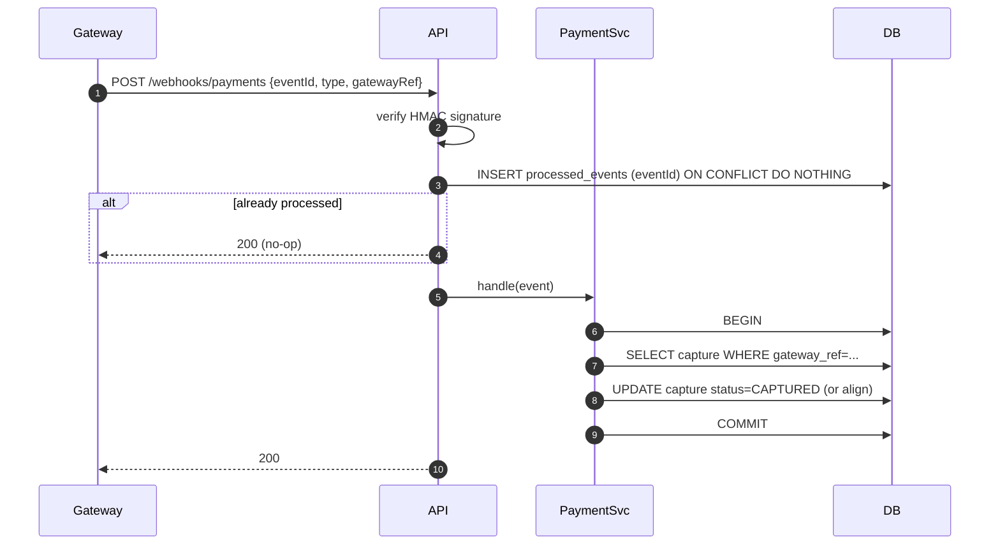

Webhook idempotency: dedupe by `eventId`; the actual data update is also idempotent because we key by gateway_ref.

---

## 10. Reconciliation — orphan auth sweep

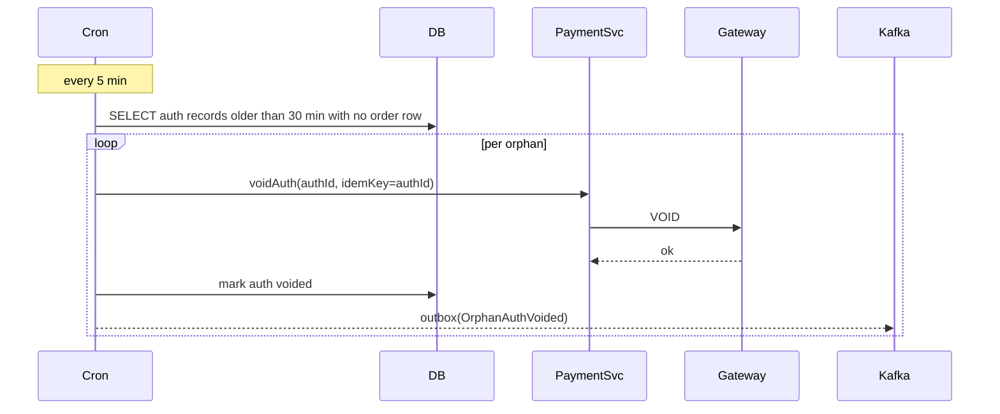

Catches the rare case where authorize succeeded but the orders TXN failed.

---

## 11. BuyBox recompute

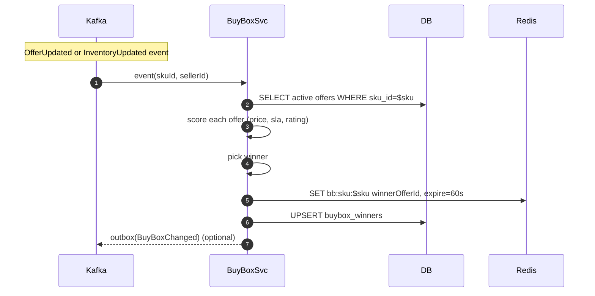

Recompute is debounced per SKU — multiple events within 1 s collapse to one recompute.

---

## What these reveal

- **Place order** is the central saga: idempotency, atomic per-line CAS, payment auth, persist + outbox.
- **Inventory conflict** rolls back cleanly — no payment attempted, no rows persisted.
- **Shipment dispatch** captures synchronously per shipment; auth-window expiry falls back to MIT.
- **Cancel** routes refund through void-or-refund based on capture state.
- **Returns** are explicitly async; refund happens only after warehouse inspection.
- **Webhooks** dedupe by `eventId`; downstream updates are idempotent.
- **Reconciliation** catches the half-states sagas leave behind.
- **BuyBox** is event-driven and eventually consistent within 5 s.
