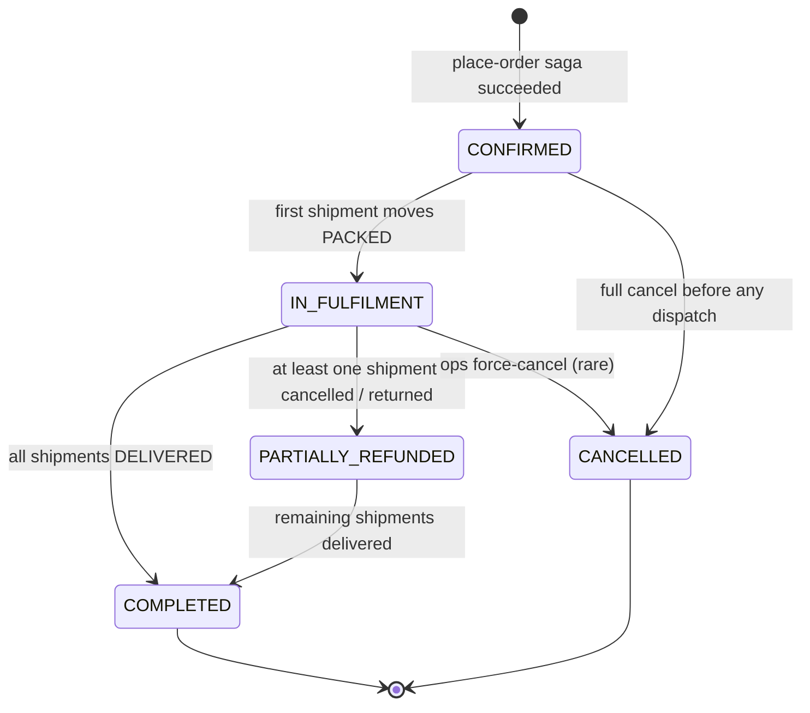
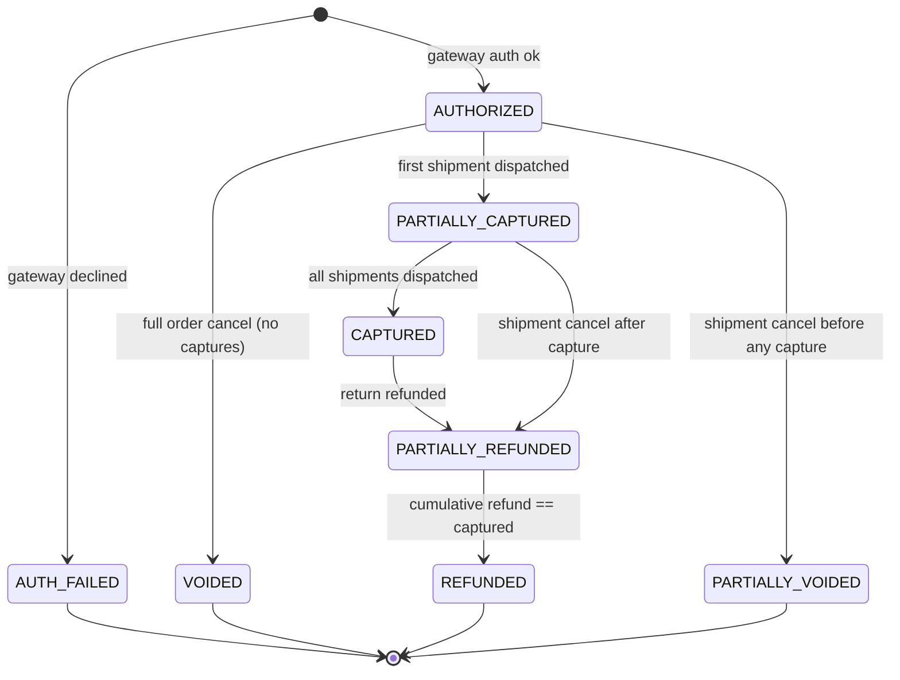
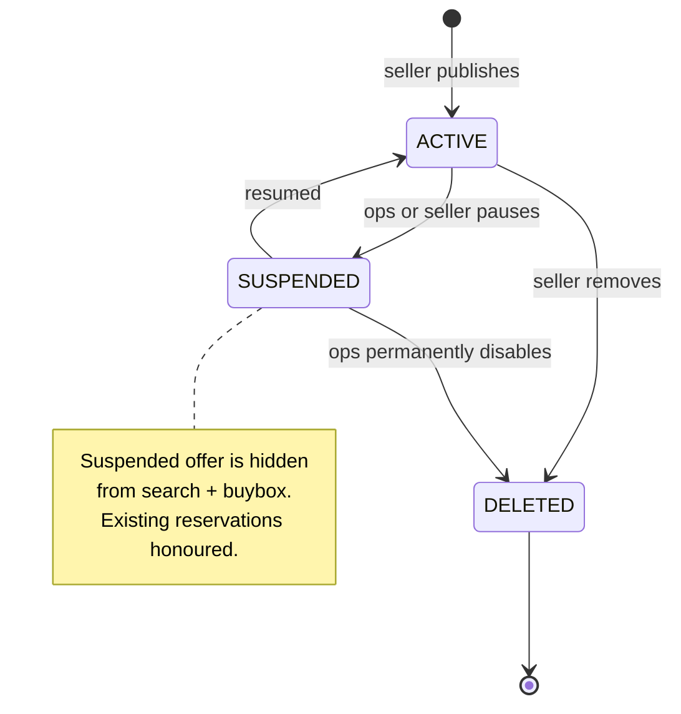
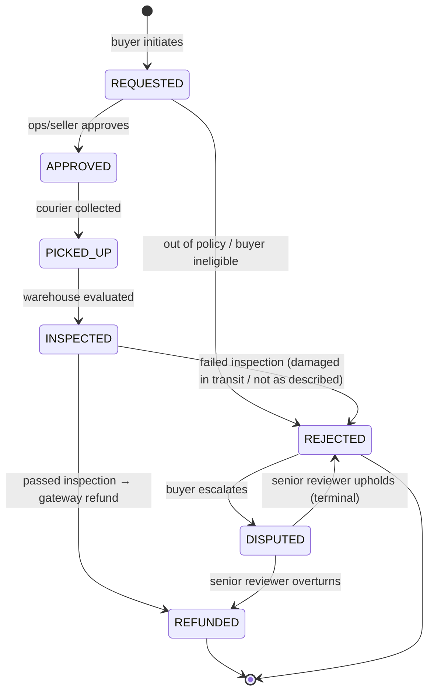
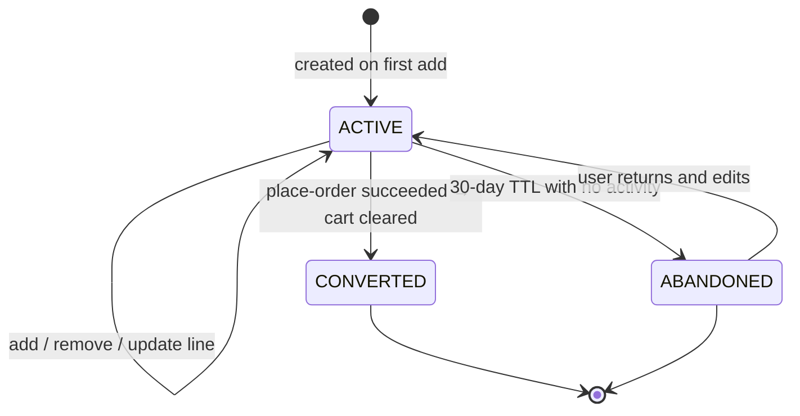
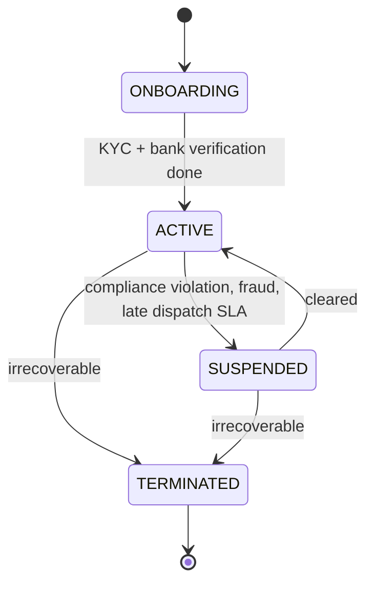
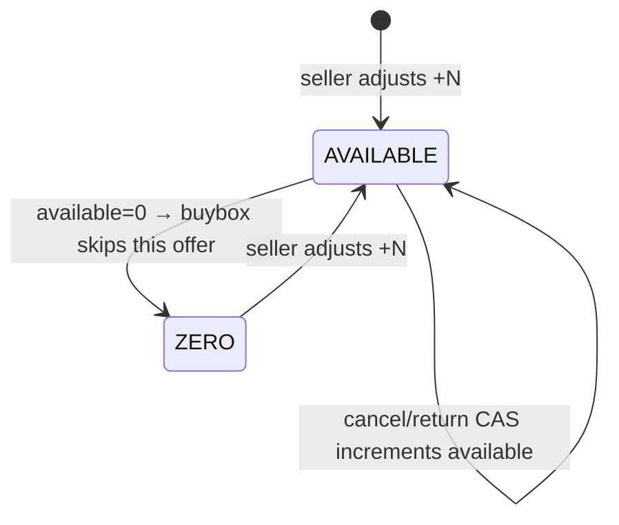

# 09 · E-Commerce — State Machines

## 1. Order



Order's status is **derived** from its child shipments — we update it via projection on every shipment status change. It's not the source of truth; it's the convenient roll-up.

> **Invariant**: An Order is **immutable in line composition** once CONFIRMED. Status advances; lines never disappear (they cancel or return, but stay as rows).

---

## 2. Shipment

```mermaid
stateDiagram-v2
    [*] --> CREATED: implicit at order
    CREATED --> PACKED: seller marks packed
    PACKED --> DISPATCHED: capture succeeded + AWB recorded
    DISPATCHED --> OUT_FOR_DELIVERY: carrier event
    OUT_FOR_DELIVERY --> DELIVERED: carrier event or buyer confirm
    DELIVERED --> RETURNED: return inspected + refunded

    CREATED --> CANCELLED: buyer cancel before pack
    PACKED --> CANCELLED: buyer cancel; refund AUTH
    DISPATCHED --> CANCELLED: buyer cancel before OUT_FOR_DELIVERY; refund CAPTURE
    OUT_FOR_DELIVERY --> RETURNED: refused at door (RTO)

    CANCELLED --> [*]
    DELIVERED --> [*]
    RETURNED --> [*]
```



Each shipment is independent. `OUT_FOR_DELIVERY` is the cut-off for buyer-initiated cancel; after that, the buyer must use the returns flow (or refuse the package at the door, which loops to RETURNED via RTO).

---

## 3. Payment (per order)



Status is derived from the running totals (`authorized_minor`, `captured_minor`, `refunded_minor`). We materialise the enum for fast filtering, but the totals are the source of truth.

---

## 4. ListingOffer



Suspending an offer **does not** unwind in-flight orders that already reserved its inventory. They proceed normally.

---

## 5. Return



The path REQUESTED → REJECTED is rare but real (e.g., perishable category, opened item). DISPUTED → REFUNDED is the buyer-protection backstop.

---

## 6. Cart



Carts are intentionally non-persistent in spirit — abandonment is normal. `CONVERTED` is the success path.

---

## 7. Seller



When a seller is SUSPENDED:
- All ACTIVE offers transition to SUSPENDED.
- In-flight shipments are flagged for ops review (not auto-cancelled — buyers may still get their goods).
- Pending payouts are held.

---

## 8. InventoryUnit

A unit has only the running counters (`available`, `reserved`); state is implicit.



The "state" is just whether `available > 0`. Buybox uses this as an eligibility gate.

---

## Allowed actions per state (order/shipment)

| Order state | User can | Seller can | Ops can |
| --- | --- | --- | --- |
| CONFIRMED | Cancel order, cancel any shipment | Pack any shipment | Force-cancel |
| IN_FULFILMENT | Cancel un-DISPATCHED shipments | Pack/dispatch | Force-cancel any |
| COMPLETED | Request return (within window) | View | Initiate refund manually |
| CANCELLED | View receipt | View | View |
| PARTIALLY_REFUNDED | Same as IN_FULFILMENT for active shipments | Same | Same |

| Shipment state | Buyer cancel? | Refund route |
| --- | --- | --- |
| CREATED | Yes | AUTH partial-void |
| PACKED | Yes | AUTH partial-void |
| DISPATCHED | Yes (until OUT_FOR_DELIVERY) | CAPTURE refund |
| OUT_FOR_DELIVERY | No (use RTO at door) | n/a |
| DELIVERED | No (use return flow) | RETURN refund |
| CANCELLED / RETURNED | terminal | n/a |

---

## Output

```
Order:        CONFIRMED → IN_FULFILMENT → COMPLETED (+CANCELLED, PARTIALLY_REFUNDED) — derived from shipments
Shipment:     CREATED → PACKED → DISPATCHED → OUT_FOR_DELIVERY → DELIVERED (+CANCELLED, RETURNED)
Payment:      AUTHORIZED → (PARTIALLY_)CAPTURED → (PARTIALLY_)REFUNDED — derived from totals
Offer:        ACTIVE ↔ SUSPENDED → DELETED
Return:       REQUESTED → APPROVED → PICKED_UP → INSPECTED → REFUNDED|REJECTED
Cart:         ACTIVE → CONVERTED|ABANDONED
Seller:       ONBOARDING → ACTIVE ↔ SUSPENDED → TERMINATED
Inventory:    counter-only; "state" is available > 0 or 0
```
