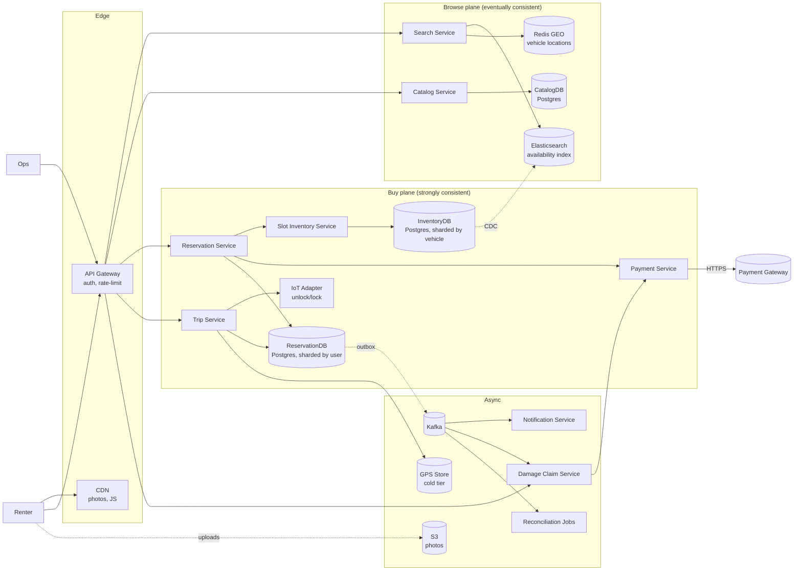

# 03 · Car Rental — High-Level Design

## Architecture overview



---

## Plane separation

The system splits explicitly into a **browse plane** and a **buy plane**, mirroring e-commerce.

### Browse plane — eventually consistent
- **Search Service** queries an Elasticsearch index keyed by `(city, vehicle_class, time_window_summary)`.
- **Catalog Service** answers per-vehicle detail (specs, photos, current fuel & last odo) from CatalogDB.
- **Redis GEO** holds current vehicle locations (parked → updated by IoT pings every 5 min when idle).
- Inventory data feeds in via CDC from the InventoryDB; up to 30 s lag is acceptable for browse.
- All caches in front + CDN-served photos. p99 < 250 ms.

### Buy plane — strongly consistent
- **Reservation Service** is the place-reservation orchestrator. It checks idempotency, reserves slots, authorises deposit, commits the reservation row.
- **Slot Inventory Service** owns the time-slot grid (one row per `(vehicle_id, hour_bucket)`).
- **Payment Service** wraps the gateway with idempotency.
- **Trip Service** owns the active trip lifecycle: pickup → in-use (GPS ingest) → return → fare compute.
- **IoT Adapter** is the only path to physical car unlock/lock; rate-limited, retry-with-backoff, circuit-breakered.
- Strongly consistent reads from primary; replicas serve "my reservations" / "my trips" listings.

---

## Component roles

| Component | Owns | Talks to |
| --- | --- | --- |
| API Gateway | AuthN/Z, rate-limit | All backend services |
| Search Service | ES index, geo lookup | ES + Redis GEO |
| Catalog Service | VehicleModel, Vehicle CRUD | CatalogDB |
| Reservation Service | The place-reservation saga | InvS, PayS, RDB, K |
| Slot Inventory Service | Time-slot grid CRUD | IDB |
| Trip Service | Pickup, in-use, return flows | RDB, IoT, GpsStore |
| Payment Service | Authorize / capture / refund / MIT | Payment gateway, RDB |
| IoT Adapter | Unlock/lock cars | Vehicle modems / OEM APIs |
| Damage Claim Service | Async post-trip damage workflow | RDB, PayS, Ops UI |
| Reconciliation Jobs | Reservation drift, payment drift, slot integrity | All services |
| Notification Service | Email/SMS/push | Kafka consumer |

---

## Hot path #1 — place reservation

```
1. POST /reservations { Idempotency-Key, vehicleId, startAt, endAt, paymentMethodId }
2. RS dedupes by (user_id, idempotency_key)
3. RS → CatS validate vehicle exists + active
4. RS → InvS reserve all hourly slots [startAt..endAt) atomically
   - One INSERT ... ON CONFLICT DO NOTHING per slot inside one TXN
   - If any conflict → rollback all + return OUT_OF_STOCK
5. RS → PayS authorize(deposit + estimated fare buffer) idempotently
6. RS persists reservation row + outbox(ReservationCreated)
7. RS returns 201 to client
8. Outbox → Kafka → notification + analytics + reminders
```

Latency budget: **600 ms p99**.

---

## Hot path #2 — pickup (unlock)

```
1. POST /trips/start { reservationId, gps: {lat, lng}, idempotency-key }
2. TripS validates:
   - reservation status = CONFIRMED
   - now in [startAt - 15min, startAt + 30min]
   - GPS within 50m of vehicle's last known location
   - haversine distance < 50m (with sanity check on velocity)
3. TripS calls IoT Adapter unlock(vehicleId)
   - 5s timeout, retry once, then ops escalation
4. TripS creates Trip row (PICKED_UP), reservation → ACTIVE
5. TripS emits TripStarted via outbox → Kafka
6. Returns 200 with door-status
```

Latency budget: **2 s p99** (IoT roundtrip dominates).

---

## Hot path #3 — return (compute fare)

```
1. POST /trips/{id}/end { gps, photos[], odoEnd, fuelEnd }
2. TripS validates:
   - GPS within 50m of approved drop zone
   - photos uploaded successfully
3. TripS computes fare using PricingService:
   - base (locked at booking)
   + per_km × (odoEnd - odoStart)
   + late_fee if return after endAt + 30min
   + fuel_deduction if fuelEnd < fuelStart
   + cleaning_fee if marked
4. TripS calls PayS captureUpTo(deposit, finalFare)
   - if finalFare ≤ deposit: capture finalFare, void rest
   - if finalFare > deposit: capture deposit + charge difference (MIT)
5. TripS marks trip RETURNED, reservation COMPLETED
6. Emits TripCompleted via outbox
```

---

## Failure modes

| Failure | Handling |
| --- | --- |
| Slot inventory shard down | New reservations on those vehicles fail fast; existing trips unaffected |
| Payment gateway down | Reservations fail with PAYMENT_GATEWAY_UNAVAILABLE; circuit breaker; can fall back to "request callback" |
| IoT unlock times out | Retry once with idempotency token; if still fails, ops dispatch + manual unlock; refund 1-hr fee |
| GPS feed lossy | Acceptable; we have pickup/return GPS + odometer for billing. Mid-trip GPS is for safety only |
| Vehicle goes offline mid-trip | Trip remains active; ops alerted; renter advised to call support; final fare computed on return regardless |
| Reservation drift (late return) | Auto-late-fee; if next reservation is already CONFIRMED on those slots, ops escalation + alternate vehicle dispatched |
| Damage claim charge declined | Move user to DUNNING; block new bookings; manual recovery |
| Photo upload fails | Trip return blocked until 4 photos persisted; retry with resumable upload |

---

## Why a saga, not 2PC

Two-phase commit across our internal Postgres + the external payment gateway + IoT modem is not feasible. Each step is idempotent; failures compensate.

| Step | Compensation |
| --- | --- |
| reserve N slots | release reserved slots |
| authorize deposit | gateway void |
| persist reservation row | implicit DB rollback |
| capture at return | refund |
| IoT unlock | IoT lock + ops escalation |

Reconciliation jobs catch half-states (e.g., authorized but no reservation row → release auth).

---

## Output

```
Two planes:    browse (eventual) + buy (strong)
Hot paths:     reserve, pickup, return — each with explicit latency budgets and saga compensations
Async:         Kafka for events, S3 for photos, GPS cold tier
Failure:       compensation per step + reconciliation safety net
External deps: payment gateway + IoT modem — both circuit-breakered
```
