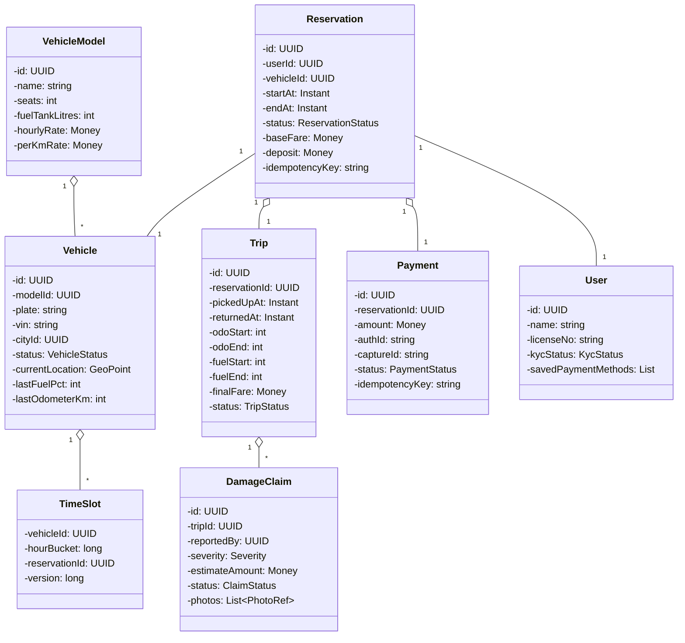

# 04 · Car Rental — Domain Model

## Core entities



---

## Aggregates

| Aggregate root | Owns | Why root |
| --- | --- | --- |
| **VehicleModel** | catalog config | Lifecycle independent from a specific car |
| **Vehicle** | TimeSlots, current state | Atomic boundary for slot writes |
| **Reservation** | Payment | The money-bearing root |
| **Trip** | DamageClaims, GPS breadcrumbs (logically) | The execution unit |
| **DamageClaim** | nothing further | Independent post-trip workflow |

> **Key invariant**: A Reservation is **immutable after CONFIRMED** in its time-window definition. A Trip records **what actually happened**. Final fare = derived from both. Editing a confirmed reservation is forbidden — instead, cancel + rebook.

---

## Value objects

| Type | Notes |
| --- | --- |
| `Money` | `(amountMinor: long, currency: string)`. Integer minor units. |
| `GeoPoint` | `(lat, lng, accuracyMetres)` |
| `HourBucket` | `epochHours: long` — granularity of the slot grid |
| `TimeWindow` | `(startAt, endAt)`; method `hourBuckets()` returns the inclusive list |
| `Idempotency-Key` | UUID; UNIQUE per `(user_id, endpoint)` |
| `PhotoRef` | S3 URL + checksum |
| `Severity` | LOW / MEDIUM / HIGH (drives review SLA) |

---

## Key concepts

### Time-slot inventory

The single most important data structure in the system.

```
timeslots:
  vehicle_id  | hour_bucket            | reservation_id | version
  KA-01-CD-1  | 2026-04-29T19:00 (h=…) | NULL           | 12
  KA-01-CD-1  | 2026-04-29T20:00       | r-abc          | 13
  KA-01-CD-1  | 2026-04-29T21:00       | r-abc          | 13
  …
```

PK is `(vehicle_id, hour_bucket)`. A reservation locks N consecutive rows by writing its `reservation_id`. Released by setting back to NULL.

Two ways to represent ownership:

1. **NULL = free, non-NULL = held**. Simplest.
2. **Two-state**: `available` row + `holds` row. More flexible but more rows.

We use option 1 — one row per slot, populated only when reserved. Postgres partial index on `(vehicle_id, hour_bucket) WHERE reservation_id IS NULL`.

### VehicleModel vs Vehicle

Same shape as Library's Book vs Copy. `VehicleModel` is logical ("Hyundai Creta 2024"). `Vehicle` is a specific physical unit (`KA-01-CD-1234`, fuel 80%, parked at HSR).

The renter searches "Creta available 7 PM Friday" — matches the Model. The system allocates one **specific** Vehicle for the reservation (cheapest closest available unit of that model).

### Reservation vs Trip

| Aspect | Reservation | Trip |
| --- | --- | --- |
| Created when | User clicks Book | User taps Unlock |
| Window | Booked window | Actual usage window |
| Source of truth for | Money expectation | Money reality |
| Can change after creation | No (immutable) | Yes (status, odo, photos) |

A reservation may produce zero or one trip (NO_SHOW → zero). A trip always has exactly one reservation.

### Pricing components

Final fare is **composed**, not single. Each component is its own evaluator:

| Component | Computed when | Source |
| --- | --- | --- |
| Base reservation | Booking | `hourly × hours` (locked) |
| Per-km charge | Return | `(odoEnd - odoStart) × per_km_rate` |
| Late fee | Return | Tiered overage on `(returnedAt - endAt)` |
| Fuel charge | Return | `max(0, fuelStart - fuelEnd) × per_litre × tank` |
| Cleaning fee | Return (or post-) | Flat amount, ops-decided |
| Damage charge | Days after return | DamageClaim → MIT charge |

Use Strategy + Composite — `CompositePricing` chains many `PricingComponent` instances and sums their outputs.

### Idempotency

| Operation | Key | Constraint |
| --- | --- | --- |
| Place reservation | client UUID | UNIQUE(user_id, idempotency_key) on reservations |
| Authorize deposit | reservation_id + retry_counter | gateway dedupes |
| Capture at return | trip_id | gateway dedupes |
| Damage charge (MIT) | claim_id | gateway dedupes; explicit consent recorded at booking |
| Webhooks | gateway eventId | UNIQUE on processed_events |

### Cancellation policy as Strategy

```
interface CancellationPolicy {
  Money refundFor(Reservation r, Instant now);
}

class TieredCancellationPolicy:
  > 24h before pickup → 100%
  6–24h → 50%
  2–6h → 25%
  < 2h → 0%
```

Different policies per city / model / promotion → swap the strategy.

---

## Domain events

| Event | When |
| --- | --- |
| `ReservationCreated` | `placeReservation` succeeded |
| `ReservationCancelled` | User cancelled; refund flow triggered |
| `NoShowDetected` | Pickup window passed without unlock |
| `TripStarted` | Vehicle unlocked at pickup |
| `TripCompleted` | Vehicle returned and fare captured |
| `LateReturnDetected` | Trip exceeded `endAt + grace` |
| `DamageClaimReported` | Ops created a claim |
| `DamageClaimApproved/Rejected` | Reviewer decision |
| `RenterDunning` | Charge declined; user blocked from new bookings |

---

## Output

```
Catalog:    VehicleModel → Vehicle (1:N)
Inventory:  TimeSlot(vehicle_id, hour_bucket) — atomic per slot
Reservation: aggregate root with embedded Payment; immutable post-CONFIRMED
Trip:       aggregate with damage claims; records actual usage
Pricing:    Composite of components; some locked at booking, some at return
Cancellation: tiered Strategy
Damage:     async aggregate with MIT charge against saved card
```
