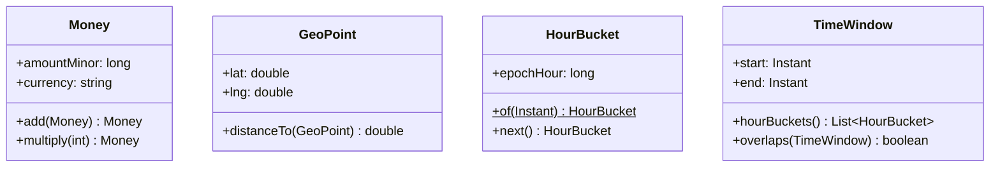
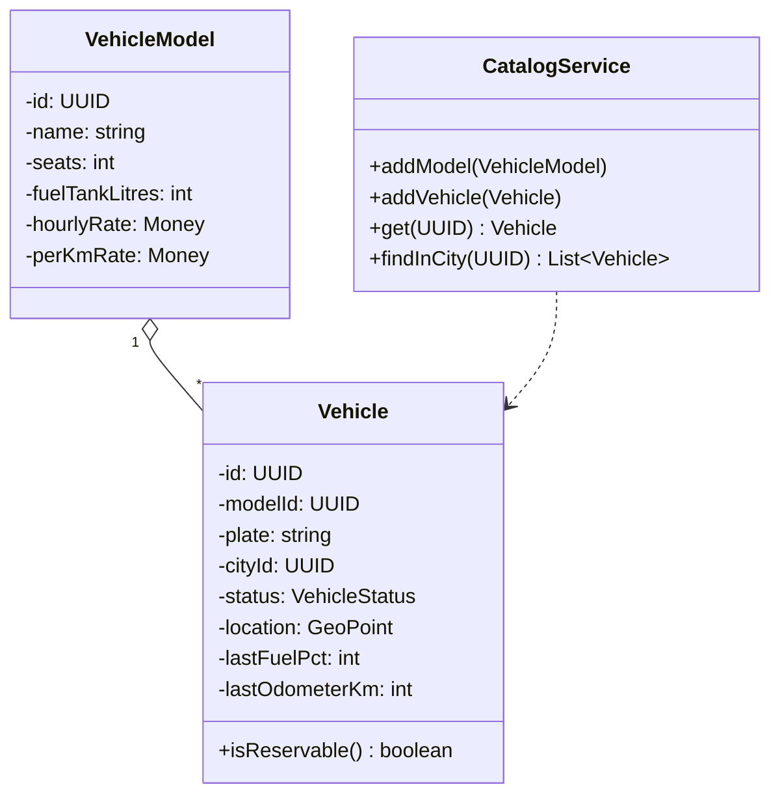
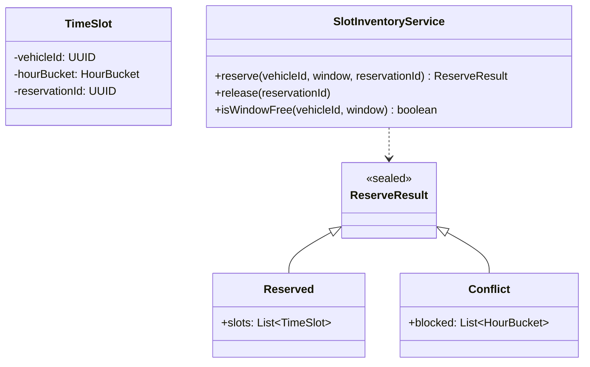
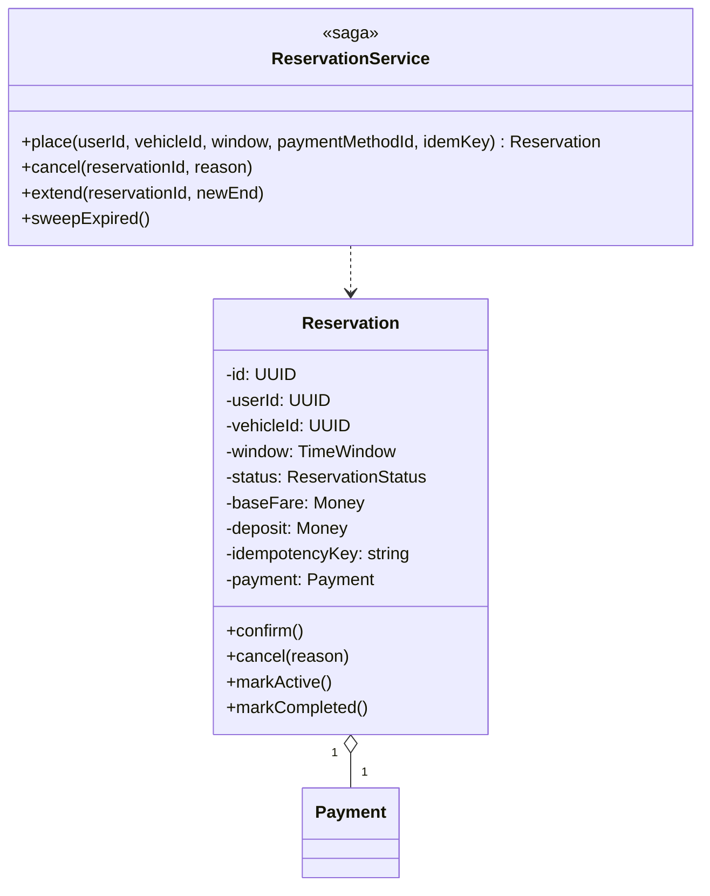
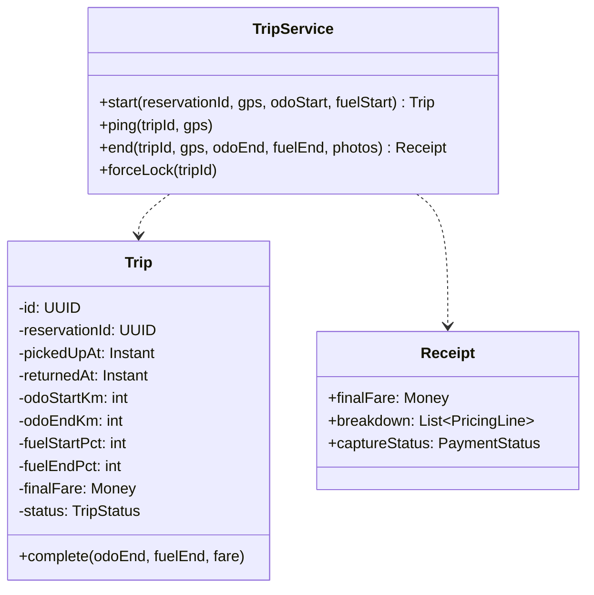
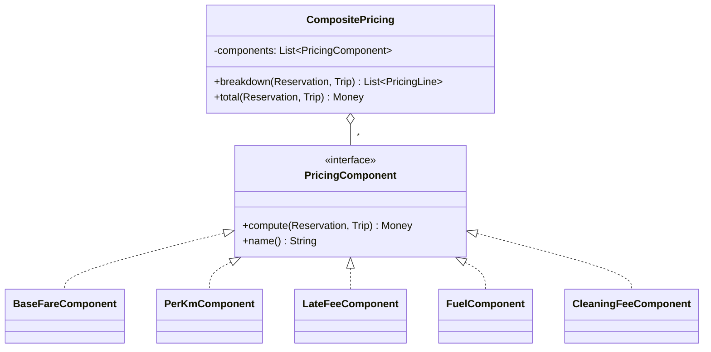
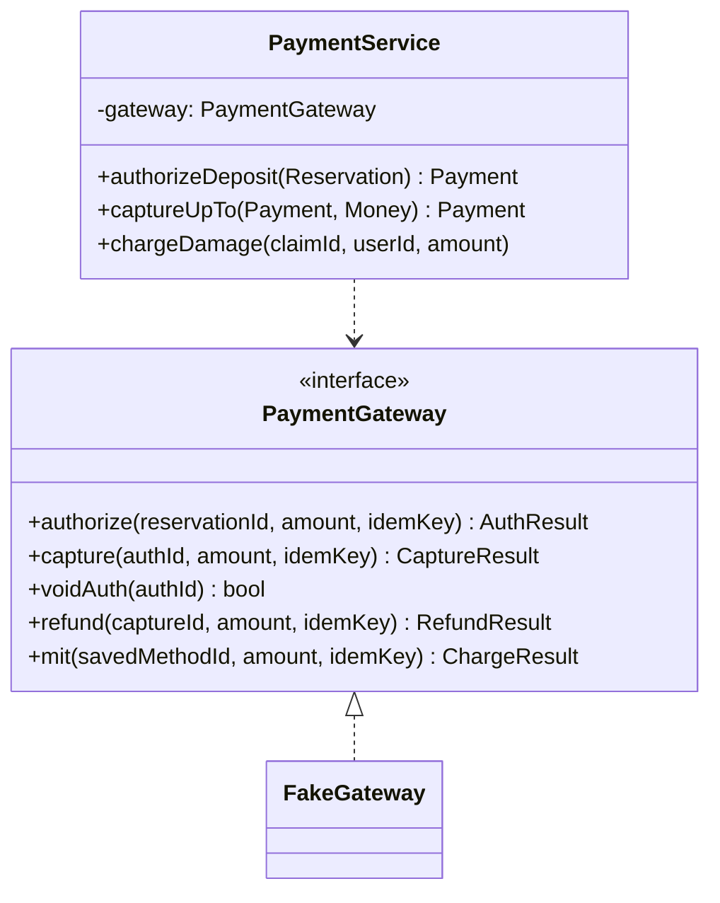

# 07 · Car Rental — Class Diagrams

## Package layout

```
com.carrental
 ├── domain/        Money, GeoPoint, HourBucket, TimeWindow, ids, enums
 ├── catalog/       VehicleModel, Vehicle, CatalogService
 ├── inventory/     TimeSlot, SlotInventoryService (atomic reservation)
 ├── reservation/   Reservation, ReservationService (the saga)
 ├── trip/          Trip, TripService
 ├── pricing/       PricingComponent + impls + CompositePricing
 ├── payment/       PaymentGateway, PaymentService, FakeGateway
 └── store/         in-memory repositories
```

---

## Domain & value objects



---

## Catalog



---

## Inventory (the heart of the design)



`SlotInventoryService.reserve(...)` mirrors the atomic SQL INSERT-or-fail. The returned `ReserveResult` is a sealed type — `Reserved` carries the inserted slots; `Conflict` lists the buckets that were already taken so the caller can show an actionable error.

---

## Reservation (the saga)



`ReservationService.place(...)` is the orchestrator:
1. Idempotency lookup.
2. Validate user (KYC) + vehicle (active).
3. Compute base fare + deposit.
4. `SlotInventoryService.reserve(...)` — atomic.
5. `PaymentService.authorize(...)`.
6. Persist Reservation.
7. Return.

Each failure compensates priors (release slots, void auth).

---

## Trip



---

## Pricing (Composite + Strategy)



Order matters: the breakdown is presented to the user in the order components are registered. Skip-on-zero is each component's own decision (e.g., FuelComponent returns Money.zero if `fuelEnd >= fuelStart`).

---

## Payment



`mit` (merchant-initiated transaction) is the path for damage charges — uses the saved payment method that the user authorized at booking, with explicit consent recorded.

---

## Why these abstractions

| Abstraction | Why |
| --- | --- |
| `SlotInventoryService` returning sealed `ReserveResult` | Two paths (success / conflict) without throwing exceptions in the hot path |
| `CompositePricing` of `PricingComponent`s | Adding a "promo discount" or "weekend surge" is a new component; doesn't touch existing code |
| `PaymentGateway` interface with `mit` separate | Damage charges require a different auth flow; modelling it as a separate gateway op is cleaner |
| `Reservation` immutable post-CONFIRMED | Edits would corrupt slot accounting; force cancel + rebook |
| `TimeWindow` value object owning `hourBuckets()` | Centralises the "how do we slice into hour buckets" logic |

---

## Output

```
Catalog:    VehicleModel → Vehicle
Inventory:  TimeSlot + SlotInventoryService(reserve, release)
Reservation: aggregate + ReservationService(saga)
Trip:       Trip aggregate + TripService(start, ping, end)
Pricing:    CompositePricing of PricingComponents
Payment:    PaymentGateway interface + PaymentService(authorize, capture, refund, mit)
```
