# 08 · Car Rental — Sequence Diagrams

## 1. Search

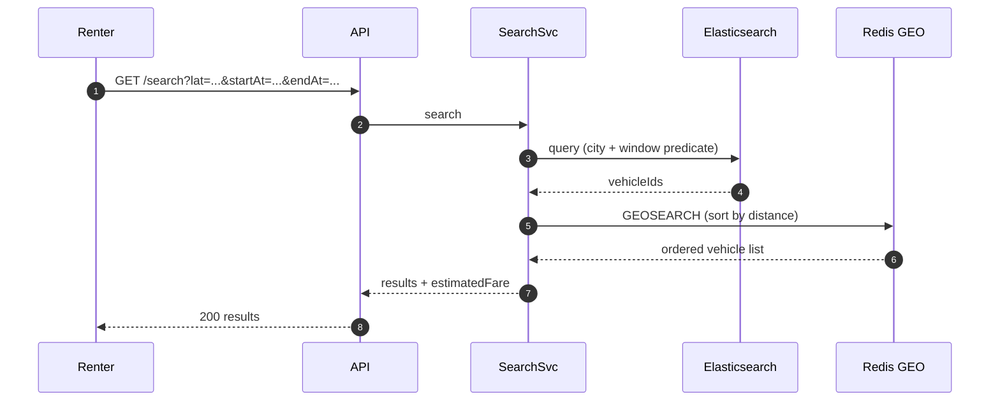

The ES index is refreshed via CDC from `timeslots` every 30 s. Search is intentionally eventually consistent — the place-reservation endpoint re-validates strictly.

---

## 2. Place reservation — happy path

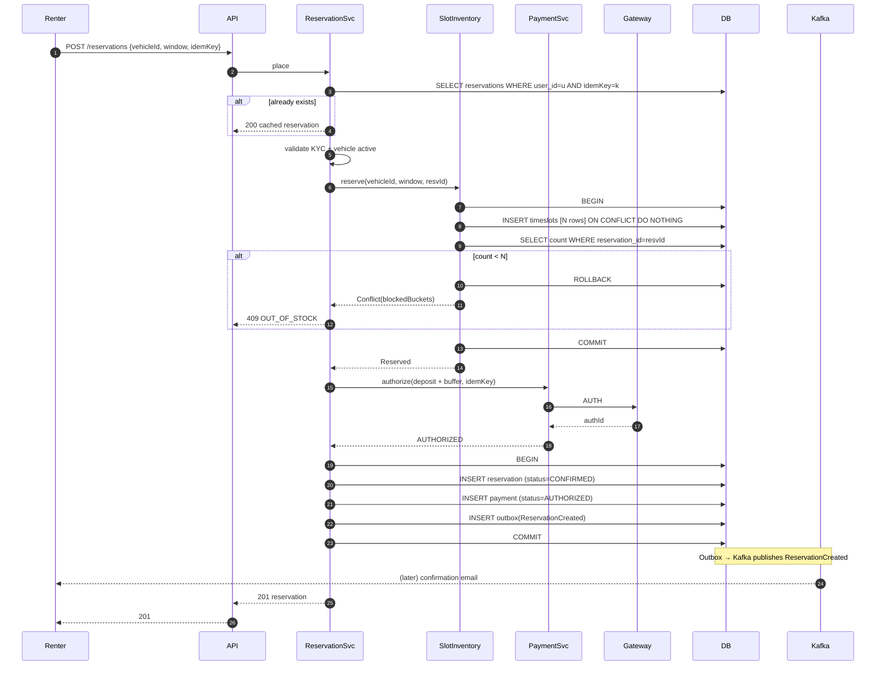

---

## 3. Place reservation — slot conflict (rollback)

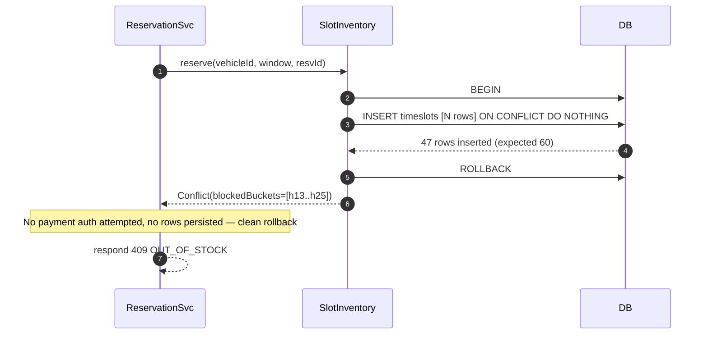

---

## 4. Place reservation — payment declined

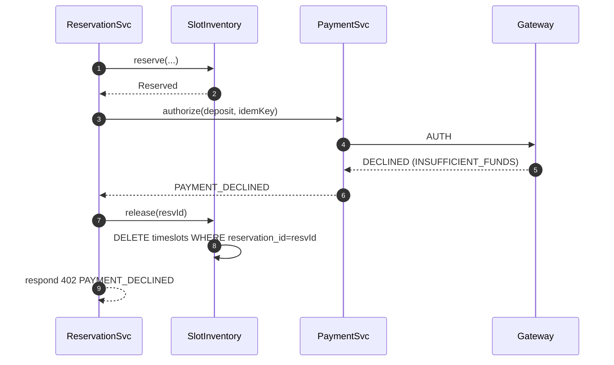

---

## 5. Pickup (unlock) — happy path

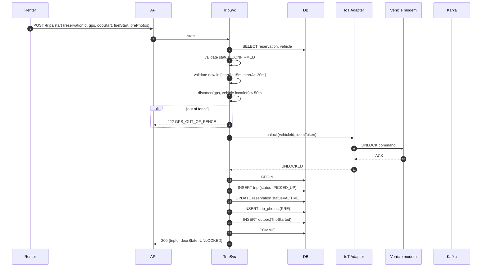

---

## 6. Pickup — IoT timeout

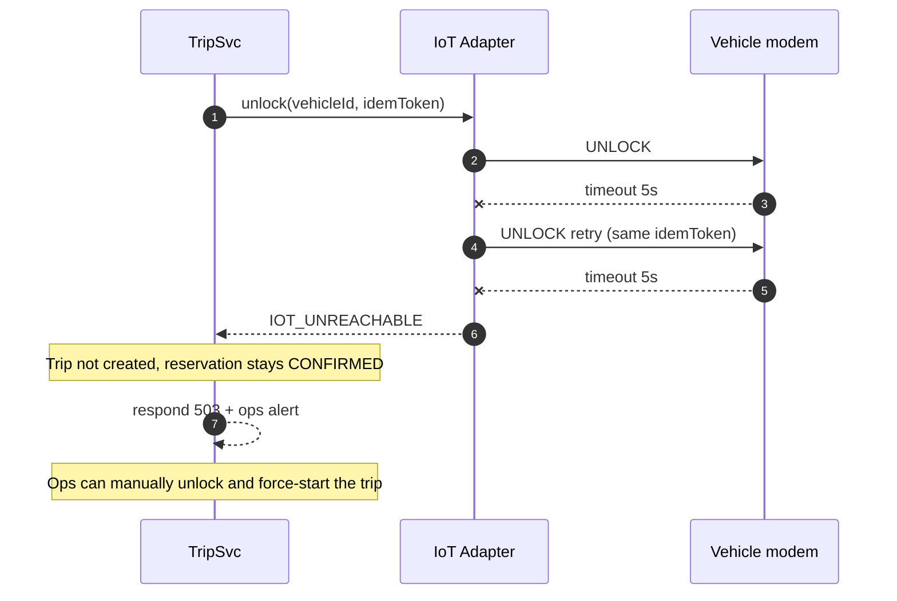

---

## 7. Return — fare compute and capture

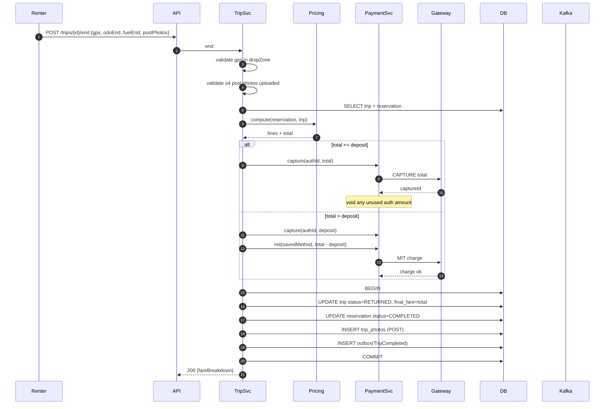

---

## 8. Cancellation

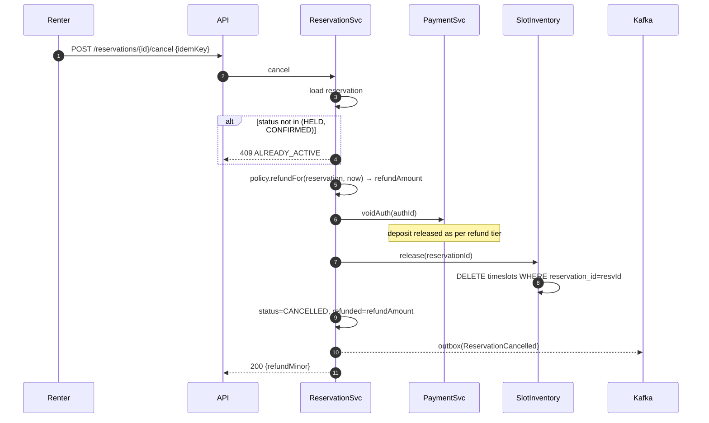

---

## 9. Damage claim — async charge

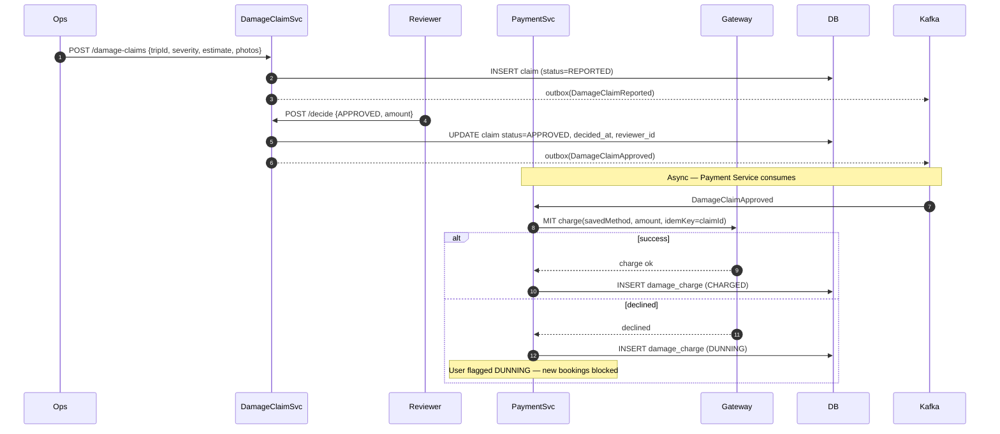

The ride end stays fast because damage assessment is async. Days later, the saved payment instrument is charged via MIT — legally backed by consent recorded at booking.

---

## 10. No-show sweep

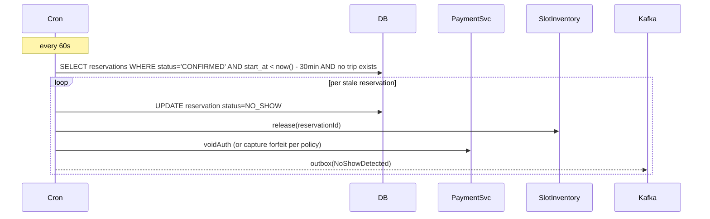

---

## 11. Reservation drift — late return

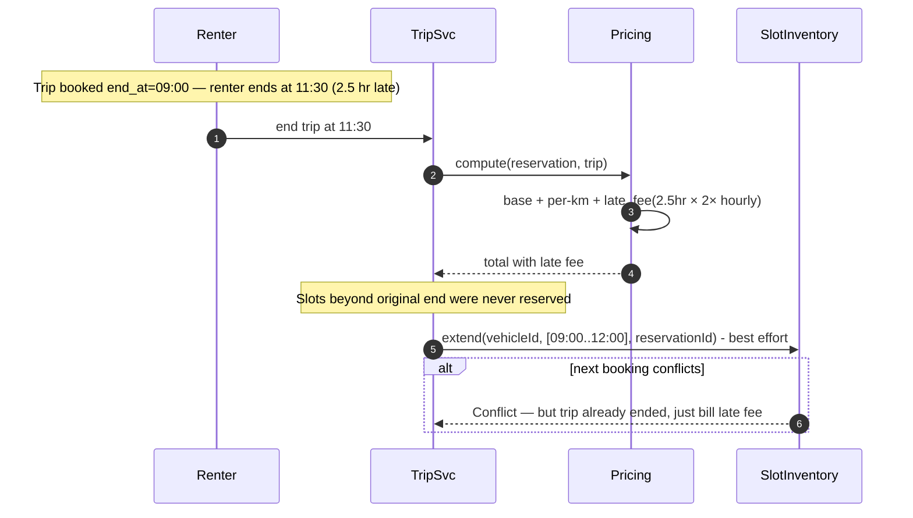

The "next renter is at 12:30" scenario triggers an ops escalation if conflict was detected mid-trip.

---

## What these reveal

- **Place reservation** is the core saga: idempotency lookup, atomic slot insert, payment auth, persist + outbox.
- **Pickup** validates GPS + window before anything happens to the vehicle. Failures don't create a Trip.
- **Return** computes fare in two stages (deposit capture, then MIT for any difference). User sees full breakdown.
- **Cancellation** voids auth + deletes slot rows in one go.
- **Damage claims** are decoupled from the trip-end hot path; they charge later via MIT.
- **No-show** is a clock-driven cron; not user-triggered.
