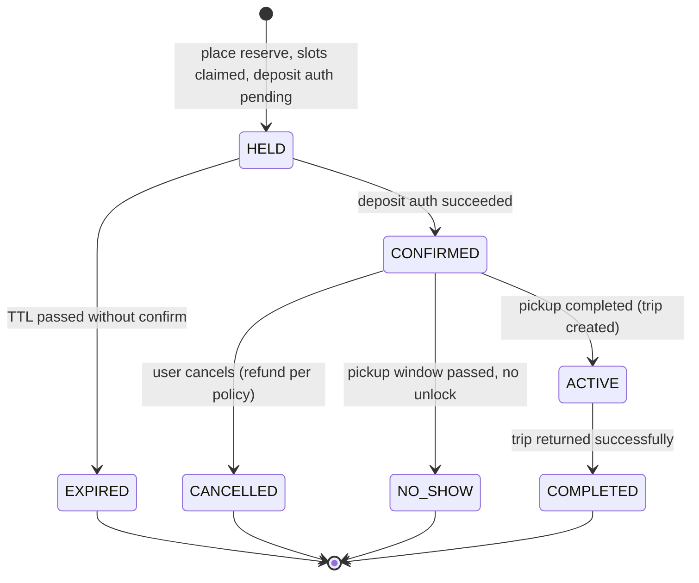
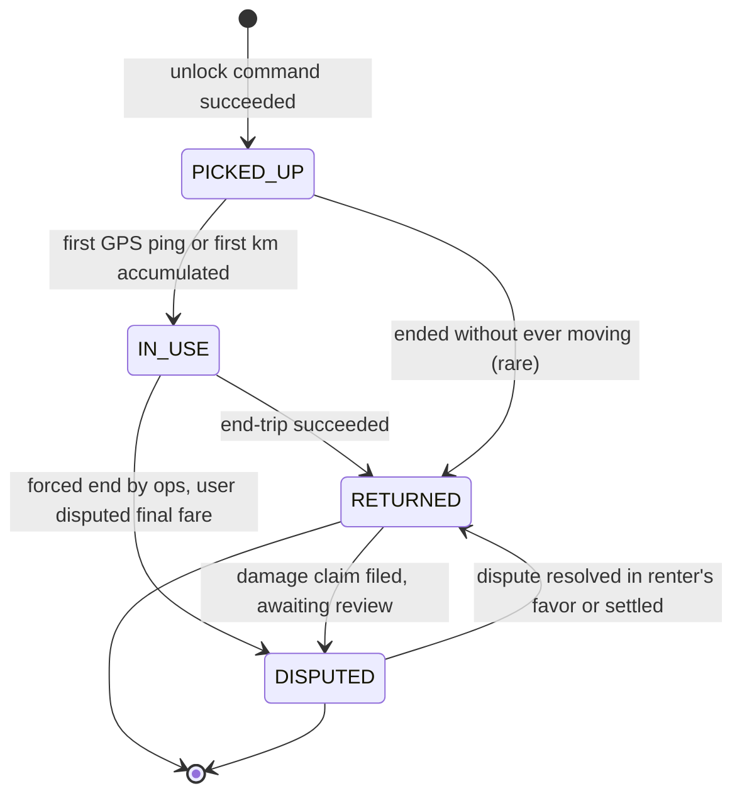
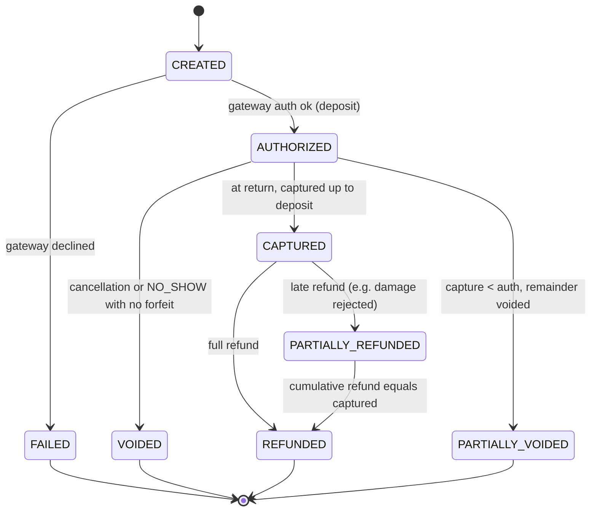
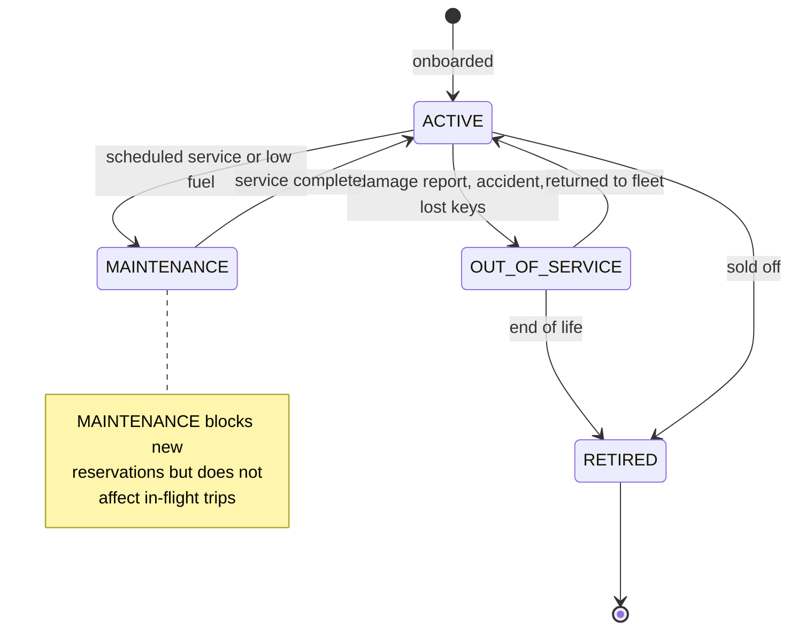
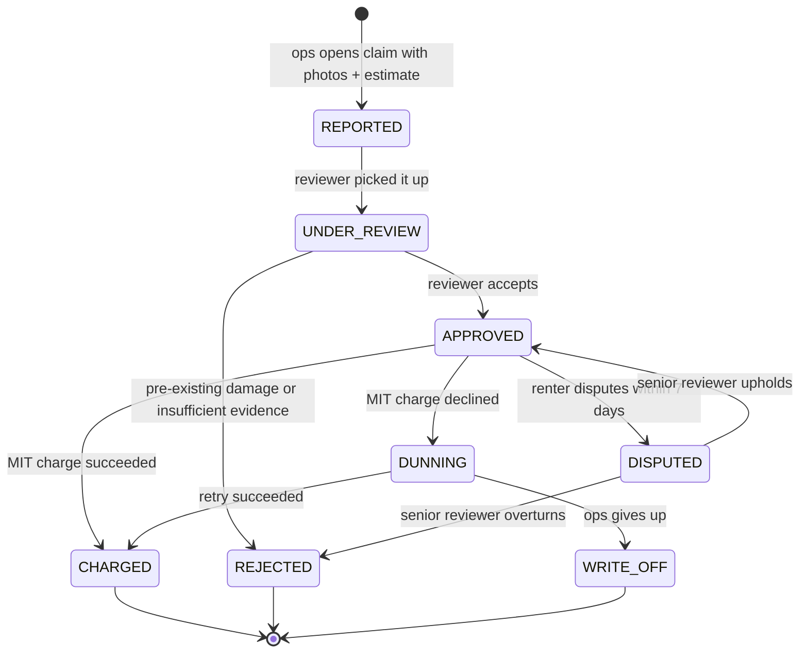
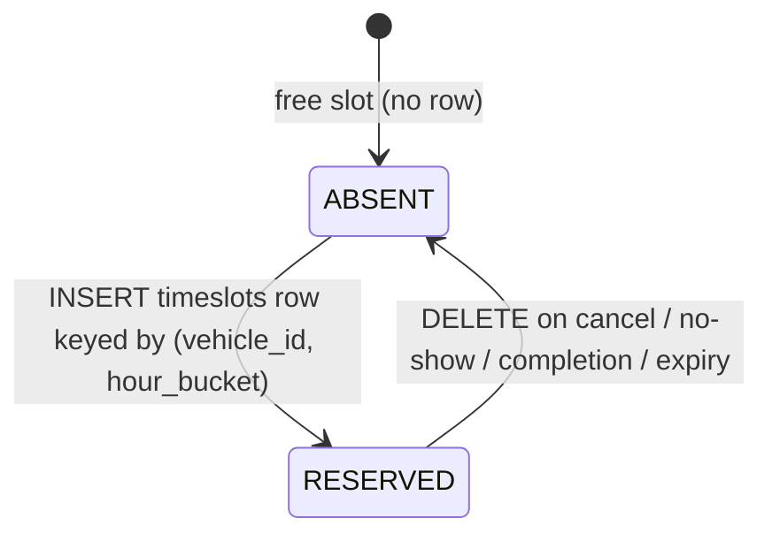
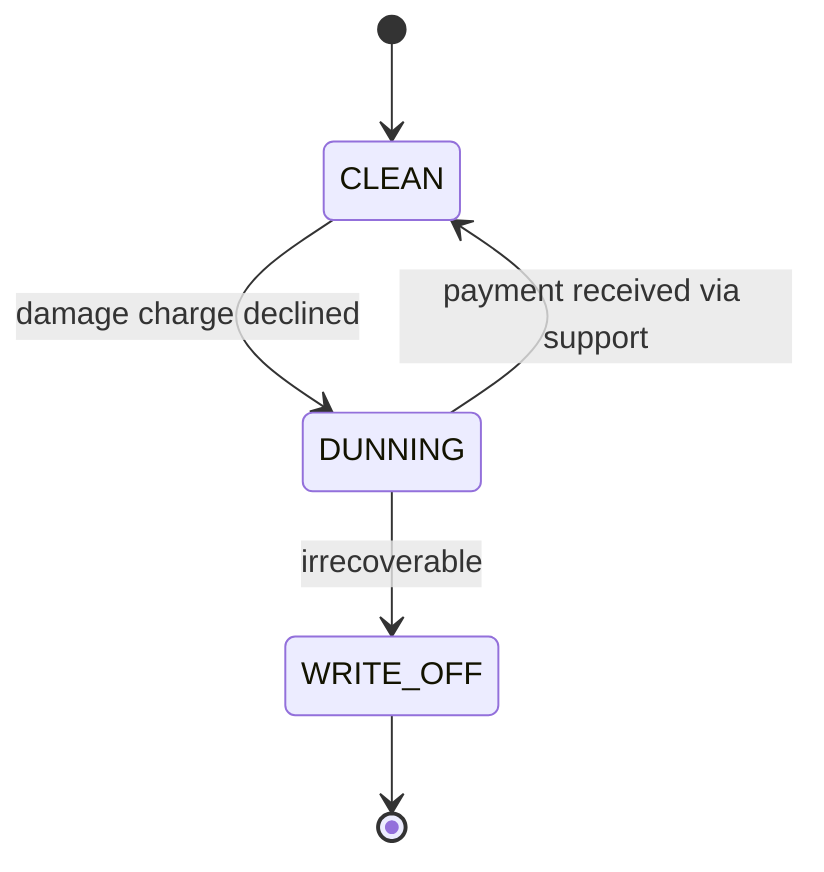

# 09 · Car Rental — State Machines

## 1. Reservation



Reservation is **immutable in window/vehicle/fare** once CONFIRMED. The status can advance, but the booked window doesn't change. Mid-trip extension creates a *new* small reservation appended to the same vehicle, not an edit of this one.

---

## 2. Trip



A Trip has a 1:1 mapping with a Reservation that reached ACTIVE.

---

## 3. Payment (per reservation)



Damage charges are **separate Payment-like rows** (see `damage_charges` table) — not a transition on the original Payment, because they happen days after `RETURNED`.

---

## 4. Vehicle



Switching to MAINTENANCE is **prospective only** — current trip continues, but no future slots can be booked until ACTIVE again.

---

## 5. Damage Claim



DUNNING also triggers a **user-level flag** that blocks new reservations until cleared.

---

## 6. TimeSlot

A timeslot has only two effective states (presence in DB):



The slot doesn't carry status of its own — its presence/absence is the state. This is the simplest model that satisfies both correctness (PK enforces atomicity) and storage efficiency (only reserved slots stored).

---

## 7. User dunning flag



While in DUNNING, the user is blocked from booking new reservations. The status is checked at the front of `placeReservation`.

---

## Allowed actions per state (reservation)

| State | User can | Ops can |
| --- | --- | --- |
| HELD | Pay (→CONFIRMED), abandon (→EXPIRED) | Force-cancel |
| CONFIRMED | Cancel (→CANCELLED), pickup (→ACTIVE) | Reassign vehicle, force-cancel |
| ACTIVE | End trip (→COMPLETED) | Force-end, recover vehicle |
| COMPLETED | View receipt, dispute | Open damage claim, refund |
| EXPIRED, CANCELLED, NO_SHOW, COMPLETED | View only | View only |

---

## Output

```
Reservation:    HELD → CONFIRMED → ACTIVE → COMPLETED (+EXPIRED, CANCELLED, NO_SHOW)
Trip:           PICKED_UP → IN_USE → RETURNED (+DISPUTED arc)
Payment:        2-phase (AUTH → CAPTURE), partial refunds supported
Vehicle:        ACTIVE ↔ MAINTENANCE / OUT_OF_SERVICE → RETIRED
Damage Claim:   REPORTED → UNDER_REVIEW → APPROVED|REJECTED → CHARGED|DUNNING|DISPUTED
Timeslot:       presence/absence (no explicit status field)
User dunning:   CLEAN ↔ DUNNING → WRITE_OFF
```
